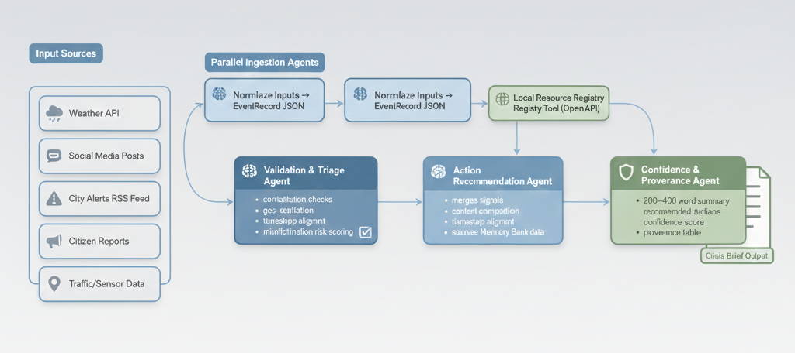

# 🛡️ CivicGuard – AI-Powered Crisis Detection & Response Agent  
### _Kaggle Gemini Capstone Project (Single-File Version)_

---

<p align="center">
  
</p>

---

# 📌 Table of Contents
- [✨ Overview](#-overview)
- [🎯 Capstone Requirements Mapped](#-capstone-requirements-mapped)
- [🧠 System Architecture](#-system-architecture)
- [⚙️ Features](#️-features)
- [📂 Repository Structure](#-repository-structure)
- [▶️ How to Run](#️-how-to-run)
- [🧪 Example Output](#-example-output)
- [📊 Risk Model Explanation](#-risk-model-explanation)
- [🧱 Technical Walkthrough](#-technical-walkthrough)
- [📜 Glossary](#-glossary)
- [📎 License](#-license)

---

# ✨ Overview
**CivicGuard** is a lightweight **multi-agent crisis analysis system** designed for rapid emergency detection, validation, summarization, and action recommendations — all in a **single Python file** suitable for:

- Kaggle Notebook  
- GitHub submission  
- Local execution  
- Offline / No API mode  

It demonstrates **all required Capstone features**:
- Multi-agent architecture (parallel + sequential)
- Tooling (custom tools)
- Memory & context compaction
- Observability + metrics
- LLM + fallback logic
- Evaluation metrics

---

# 🎯 Capstone Requirements Mapped

<details>
<summary><strong>🧩 Click to see mapping to official Capstone Requirements</strong></summary>

### **1. Multi-Agent System**
- Parallel ingestion agents  
- Sequential validation & triage agent  
- Summarization agent (LLM stub)  
- Action Recommendation agent  

### **2. Tools**
- Custom Resource Registry Tool  
- MemoryBank (context engine)  
- Geo-distance tool  
- No external APIs (offline safe)

### **3. Long-running Operations**
- LLM stub with random simulated failure  
- Automatic fallback mechanism  
- Resilient inferencing pipeline  

### **4. Sessions & Memory**
- MemoryBank with nearest-shelter lookup  
- Context compaction for LLM grounding  

### **5. Observability**
- Evidence confidence  
- Trust models  
- Severity scoring  
- Risk scoring  
- Validation metadata  
- Full audit trail  

### **6. Evaluation**
- Provenance coverage score  
- Unique source diversity metric  

</details>

---

# 🧠 System Architecture

## **🧩 High-Level Design**
<details>
<summary><strong>Click to expand architecture explanation</strong></summary>

```
+------------------------------------------------------+
|                     CivicGuard                       |
+------------------------------------------------------+
|  Parallel Agents                                      |
|  - Social Ingestion  ----┐                            |
|  - Weather Ingestion ----┘                            |
+------------------------------------------------------+
|  Validation & Scoring Agent                           |
+------------------------------------------------------+
|  Memory & Context Engine                              |
|  - Asset lookup                                       |
|  - Shelter proximity                                  |
+------------------------------------------------------+
|  Summarization Agent                                  |
|  - LLM Stub                                           |
|  - Fallback                                           |
+------------------------------------------------------+
|  Risk Model                                           |
+------------------------------------------------------+
|  Action Recommendation Agent                          |
+------------------------------------------------------+
|  Outputs                                              |
|  - Crisis Brief                                       |
|  - Recommended Actions                                |
|  - Risk Score                                         |
+------------------------------------------------------+
```

</details>

---

# ⚙️ Features

### ✔ Multi-Agent Pipeline  
Parallel ingestion → sequential validation → summarization → recommendations.

### ✔ Evidence-Based Validation  
- Trust weighting  
- Severity keyword classifier  
- Recency weight  
- Confidence score + priority

### ✔ LLM Stub + Rule-Based Fallback  
Completely offline-safe.

### ✔ Memory-Aware Context Compaction  
Uses nearest shelters dynamically.

### ✔ Risk Modeling  
Simple yet explainable risk score.

### ✔ Interactive Output  
Summaries, actions, audit logs.

---

# 📂 Repository Structure

```
CivicGuard/
│
├── main.py
├── README.md
└── architecture.png
```

---

# ▶️ How to Run

### **📌 Run in Kaggle Notebook**
```
!python main.py
```

### **📌 Run Locally**
```
python main.py
```

---

# 🧪 Example Output

<details>
<summary><strong>Click to view sample crisis brief</strong></summary>

```
Crisis Brief (2025-11-25T10:27Z):

- tweet [t1]: Water rising fast on Elm St near 5th! Cars stuck.
  Confidence=0.82, Priority=high

- reddit [r1]: Flooding reported near Riverside Market. Traffic bad.
  Confidence=0.65, Priority=medium

Context:
Relevant community assets:
- Community Hall (cap 200)
- High School Gym (cap 500)

Recommended: Avoid the affected zone, check nearest shelters.
```

</details>

---

# 📊 Risk Model Explanation

<details>
<summary><strong>Click for details</strong></summary>

Risk Score =  
```
0.4 * evidence_confidence  
+ 0.3 * severity  
+ 0.2 * population_density_factor  
+ 0.1 * historical_incidents
```

Produces a 0–1 normalized risk index.

</details>

---

# 🧱 Technical Walkthrough

<details>
<summary><strong>Click for expanded agent walkthrough</strong></summary>

### **1. Parallel Ingestion**
ThreadPoolExecutor ingests social + weather streams.

### **2. Validation**
Each event is enriched with:
- trust  
- severity  
- recency  
- evidence confidence  
- priority  

### **3. Context Compaction**
MemoryBank finds nearest shelters using haversine distance.

### **4. Summarization**
LLM stub creates a crisis brief.  
If it fails → fallback summary.

### **5. Risk Estimation**
Based on explainable weighted scoring.

### **6. Action Recommendation**
Nearest shelters + emergency guidelines.

</details>

---
# Deployment Diagram
<p align="center">
  
</p>
---

# 📜 Glossary

| Term | Meaning |
|------|---------|
| **EventRecord** | Canonical normalized input event |
| **MemoryBank** | Tool storing offline assets |
| **LLM Stub** | Controlled summarizer for offline mode |
| **Evidence Confidence** | Hybrid score of trust + severity + recency |
| **Fallback** | Backup logic when LLM fails |
| **Provenance** | Source tracking |

---

# 📎 License
MIT — free to use.

---

# 🎉 THANK YOU  
If you need:
✅ YouTube video script  
✅ Kaggle submission write-up  
✅ Visual architecture PNG  
Just ask!
